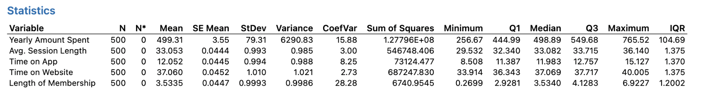
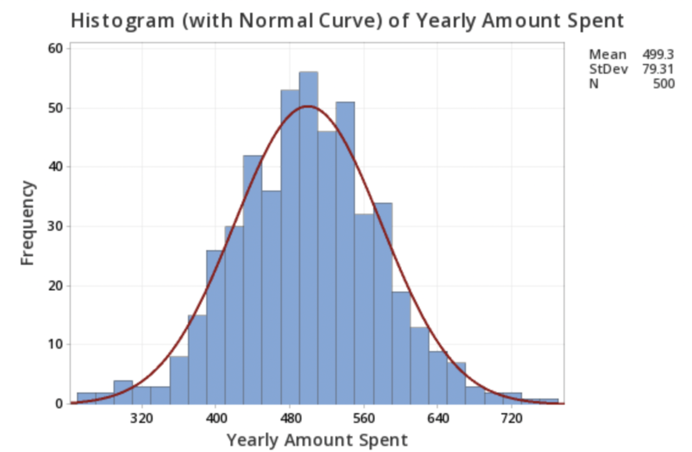
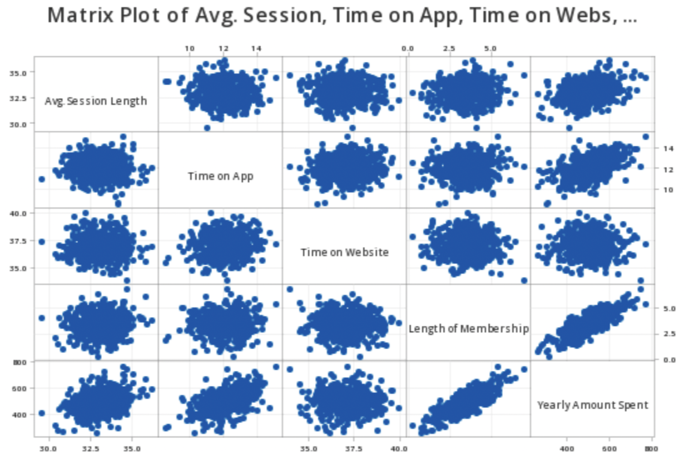
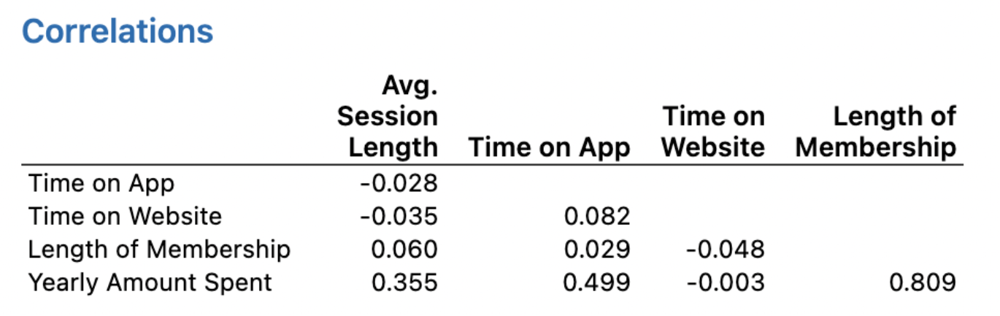
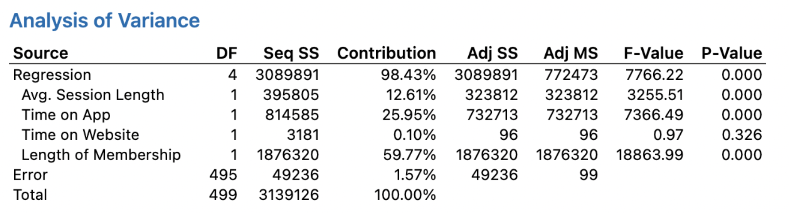
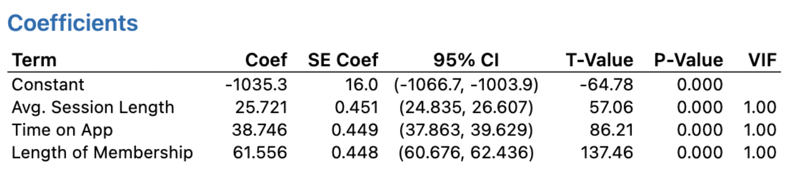
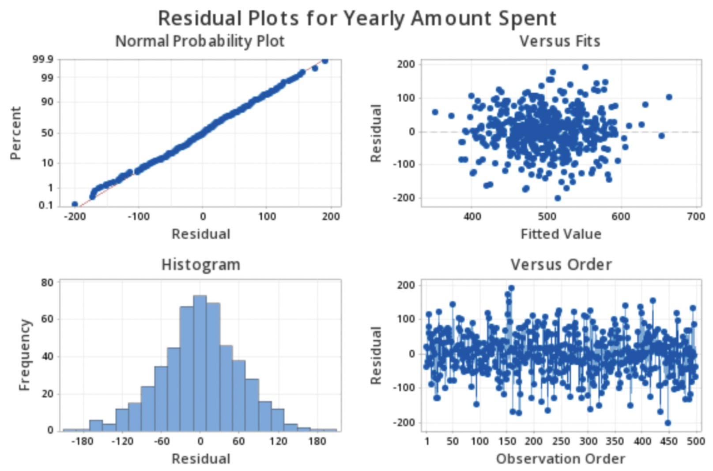
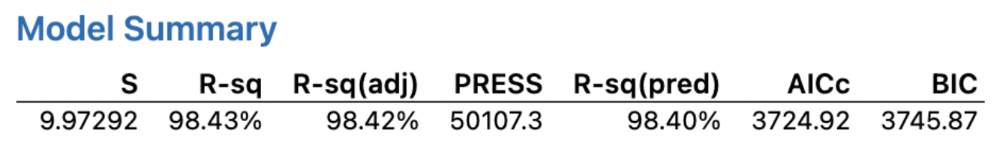
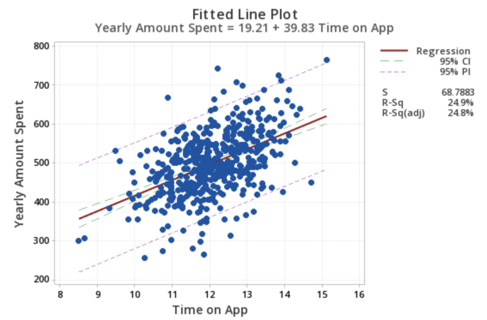

# Purchasing-Probability-of-E-Commerce-Customers
Predicting the Purchasing Probability of E-Commerce Customers using Statistics

<h2>Introduction:</h2>

Each year, the number of Internet users grows, resulting in an increase in the volume of online purchases (e-commerce) by 15-20 % [1], greatly surpassing the expansion of traditional brick-and-mortar commerce. The primary incentives for purchasing online are said to be low pricing, time savings, and convenience [2]. Similarly, a significant portion of today’s e-commerce research investigates strategies to boost online shopping income, notably through a better knowledge of consumer online behavior.

Research in online commerce is heavily focused on identifying and understanding the factors that drive behaviors of users, since such findings can have immediate and direct impact on the sales volumes. One of the long-established principles in the field has been that the more time a prospective customer spends in a visit, the more likely is the purchase decision.

  
<h2>Related Work:</h2>

Visit duration has long been considered a crucial performance metric in e-commerce, boosting conversion rate and indicating commitment to the e-tailor. In order to quantify the financial return on website visit duration, data from 94 online retailers were statistically analyzed and numerous hypotheses were tested. However, overall a plausible model of user purchasing decision-making has been developed. The PLS (General Partial Least Squares) simulations obtained did not indicate a relationship between website ranking and visit duration. A type II tobit model was put forth by the authors of an even more reputable study [3] to indicate the visitors’ decisions to stay on the website or leave, as well as the amount of time spent viewing each page. The findings revealed that the likelihood of visitors to stick around and browse varied dynamically according to the length of their site visit and the frequency of their return visits. In [4], the authors looked into a number of groupings of variables affecting how long a website visit lasts. To estimate the impact of these characteristics on the user’s visit time and number of pages viewed, a random effects model was used. The findings revealed that older persons and women spend more time on websites, while the majority of the sites that featured lots of advertisements got visited less frequently.

The above study’s findings, along with those from related research projects, have been deemed useful in enhancing (optimizing) e-commerce websites in order to increase average visit durations and, presumably, sales. For the reasons listed below, the ”time on site” measure has been significant in internet business for more than 20 years. The more time a person spends browsing the website’s store, the more interested she becomes in its products [5], and this interest should result in a purchase. Furthermore, during the past few years it has been highlighted time and time again that mobile commerce is expanding even more quickly than e-commerce, with a reported annual rate of 20-35% [6]. More than half of online store visits currently take place on mobile devices, and sales are anticipated to catch up [7]. However, it is still underexplored in the study that has come to our attention as to whether the elements influencing the purchase-making behavior of potential online customers who utilize mobile applications are the same as for websites.

<h2>Data Source:</h2>

The dataset that we used in the study is the E-commerce Dataset, openly accessible through Kaggle repository. This dataset offers information on customers who prefer to purchase online. The dataset consists of eight attributes, making up a total of 500 different customer data. The time spent on the website and the time spent on the mobile application are our independent variables. The store’s annual income (purchases made on the online store) is the dependent variable.

<ul><li>Email - Email of the customer</li>
<li>Address - Address of the customer</li>
<li>Avatar - Color of the online icon of the customer profile</li>
<li>Average Session Time - Customer spends time in the physical store for consultation • Time on App - Time spent on app to order the product</li>
<li>Time on Website - Time spent on website to order the product</li>
<li>Length of Membership - Years since they have been an active member of the store • Yearly Amount Spent - Amount spent by a customer, annually (Response Variable)</li></ul>

Figure 1: Descriptive Statistics 

Figure 1 displays the descriptive statistics of the dataset including mean, median, variance, standard deviation and IQR.

<h2>Method of Analysis:</h2>

The method of analysis starts with the assumptions of the model. The assumptions are made based on the pairwise scatter plot Figure 3. From the pairwise scatter plot we see that the data points are normally distributed and there are no potential outliers which means that the variance is constant. Also, the variables are highly correlated with each other. The null hypothesis for this problem is that the Yearly Amount Spent is affected by none of the variables and the alternative hypothesis is that at least one of the four variables affect the Yearly Amount Spent. Performing the correlation matrix will show which variables are highly correlated. Figure 2 displays the frequency of yearly amount spent through a histogram.

 
Figure 2: Histogram - Yearly Amount Spent Vs Frequency
Figure 3: Pairwise Scatter Plot

From the correlation table Figure 4 we can see that the Yearly Amount Spent and Length of Membership are highly correlated. With that information, the regression equation for Yearly Amount Spent with all the four independent variables is Figure 5. For the regression equation in Figure 5 the ANOVA table is given in Figure 6.

Figure 4: Correlation Matrix
Figure 5: Initial Regression Equation
Figure 6: ANOVA

Lastly, upon performing influence analysis using leverage points, Cook’s Distance and DFFITS, we utilized the leverage points and removed few data points(as per Cook’s Distance and DFFITS). This made our final model robust with optimal solutions.

There are a few methods for performing variable selection, and one is to incrementally fit models with higher and higher order terms until the t test for the highest order term is nonsignificant. The method is known as forward selection. With the three independent variables average session length, time spent using the app, and membership length, we are able to select the optimal model looking forth to determine the annual amount spent.

<h2>Results:</h2>

Based on our analysis from the previous section, the final regression equation is mentioned in Figure 7.

Figure 7: Final Regression Equation
Figure 8: Final Coefficient Table

From the Coefficient table in Figure 8, we observe that P-value is less than the significance level of 0.5. Thus, we accept the alternate hypothesis that the response variable is dependent on at least one of the predictor variables. In our case, the response variable (yearly amount spent) is dependent on ‘Length of Membership’, ‘Average Session Length’ and ‘Time on App’.

Figure 9: Residual Plot

From the residual plot Figure 9, we deduce that the least squares regression line lies exactly along a straight line, indicating normal distribution. Also all the variables are independent as there is no multicollinearity observed from the Correlation matrix and the VIF values.

Figure 10: Model Summary

After performing all the analysis steps which includes hypothesis testing, variable assump- tion and independence, multicollinearity verification, variable selection; we arrive at the best model for this problem and dataset.

Figure 11: Confidence and Prediction Bands

98.42% variability of ‘Yearly Amount Spent’ can be explained by Adjusted R-square value from the model summary table. The final coefficients table (Figure 8) shows that, when all other factors are held constant, a one-unit increase in average session length corresponds to a 25.721 increase in total spending. Holding all other aspects constant, an increase of 1 unit in Time on App results in an increase of 38.746 dollars in total expenditures. Keeping all other parameters constant, a 1 unit increase in Length of Membership corresponds to an increase in total spending of 61.556 dollars. The confidence and prediction bands for time spent on app versus annual amount spent are shown in the figure 11.

<h2>Conclusion:</h2>

We determine for an e-commerce company whether to concentrate their efforts on their mobile app experience or their website based on the findings of the performed linear regression. The data description makes it apparent that the user might gather all the information required to make a buying decision during one visit, and then make the actual purchase at a subsequent, shorter visit.

In several related studies, for instance [8], the authors conducted a study contrasting purchases made using a mobile application and website. According to the data analysis’s findings, users choose mobile applications over websites for their online purchasing needs in terms of searchability, accessibility, and other factors. This may indicate a general movement in consumer purchasing behavior toward mobile commerce, whilst websites (browsed on desktop computers) are frequently used for different purposes. In any event, we want to emphasize that, despite being a somewhat indirect measure, the amount of time customers spend in online businesses is nevertheless significant.

Firstly, it helps to keep customers interested in the store, which may result in future purchases [9]. Second, taking into account how long a visitor stays on a website is crucial when placing adverts, which will increase revenue [10]. On the other side, it’s possible that excessive web advertising is what drives consumers to mobile applications by reducing the usefulness and aesthetic appeal of websites. One of our future research priorities includes taking these mixed impacts into account when modeling consumer behavior for online stores. As a result, we come to the conclusion that e-commerce businesses should concentrate on the mobile app experience rather than the website experience.

<h2>References:</h2>
[1] J. Weisberg, D. Te’eni, and L. Arman, “Past pur- chase and intention to purchase in e-commerce: The mediation of social presence and trust,” Internet research, 2011. 
[2] T. W. Dillon and H. L. Reif, “Factors influencing consumers’ e-commerce commodity purchases.” Information Technology, Learning & Performance Journal, vol. 22, no. 2, 2004. 
[3] S. Akter and S. F. Wamba, “Big data analytics in e-commerce: a systematic review and agenda for future research,” Electronic Markets, vol. 26, no. 2, pp. 173–194, 2016. 
[4] H. Yu and X. Zhang, “Research on the application of iot in e-commerce,” in 2017 IEEE International Conference on Computational Science and Engineering (CSE) and IEEE International Conference on Embedded and Ubiquitous Computing (EUC), vol. 2. IEEE, 2017, pp. 434–436. 
[5] M. Z. Shahrel, S. Mutalib, and S. AbdulRahman, “Pricecop-price monitor and prediction using linear regression and lsvm-abc methods for e-commerce platform.” International Journal of Information Engineering & Electronic Business, vol. 13, no. 1, 2021. 
[6] O. Dospinescu, N. Dospinescu, and I. Bostan, “Determinants of e-commerce satisfaction: A comparative study between romania and moldova,” Kybernetes, 2021. 
[7] B. Givan, R. Wirawan, D. Andriawan, N. Aisyah, A. Asep, and A. S. Putra, “Effect of ease and trustworthiness to use e-commerce for purchasing goods online,” International Journal of Educational Research & Social Sciences, vol. 2, no. 2, pp. 277–282, 2021. 
[8] T. T. Kidane and R. Sharma, “Factors affecting consumers’ purchasing decision through ecommerce,” in Proceedings of the 2016 International Conference on Industrial Engineering and Operations Management Kuala Lumpur, Malaysia, vol. 8, no. 10, 2016, pp. 159–165. 
[9] S. Dreiseitl and L. Ohno-Machado, “Logistic regression and artificial neural network classifica- tion models: a methodology review,” Journal of biomedical informatics, vol. 35, no. 5-6, pp. 352– 359, 2002. 
[10] D. I. Lee and H. G. Kim, “The dynamic research of mobile and pc online media visit activities ef- fects on the e-commerce site visit,” Journal of the Korean Operations Research and Management Science Society, vol. 39, no. 4, pp. 85–95, 2014. 
